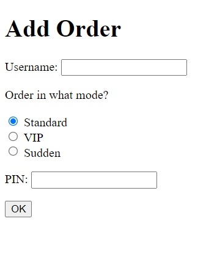
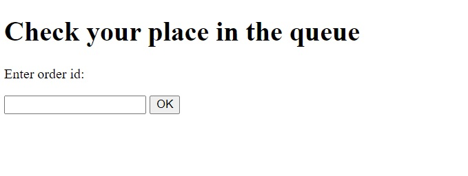

# post-office
A program that imitates the queue at the traditional post office. For recruitment purposes.
## Table of Contents
* [General Info](#general-information)
* [Technologies Used](#technologies-used)
* [Features](#features)
* [Screenshots](#screenshots)
* [Setup](#setup)
* [Project Status](#project-status)
* [Contact](#contact)

## General Information

Recorder
On the form, allow the user to enter a nickname and optionally select "VIP" or "Sudden".
Selecting one of these options requires confirmation with a PIN. After sending the form, it will be generated
a unique number to be added to the queue. If the user selects "VIP" or "Emergency":
• VIP - is automatically moved to the top of the queue. Another VIP is added after the last VIP.
• Sudden - leads to entry out of sequence.
Selecting the "VIP" / "Sudden" additional field requires authorization by entering a PIN:
• VIP - 8888,
• Emergency - 0000.

Queue monitoring
By default, the list of people in the queue is presented, sorted in the order that takes into account the above
priorities. The list displays the number assigned by the registrar and the nickname.
Monitoring makes it possible to check how many people are in front of a given user. After entering the obtained number
during registration or a nickname, the number of people in the queue in front of the selected user and the time are displayed
expectations.

## Technologies Used
- JAVA
- Spring Boot
- REST
- Hibernate

## Features

Application example: Online lessons. The student logs into the application, selects the room corresponding to the current activity. 
In the application, the teacher asks questions about the topic being presented. The honest answers and the teacher can evaluate the answers.

## Screenshots

## Setup
Save the "post_office" database on your computer and import it into the AMPPS program. Clone the repository and run it. go to
http: // localhost: 8080 / newOrdes
to add an order or
http: // localhost: 8080 / getQueueByOrderId
to see the complete order list with lead times.

## Project Status
Program brought to the stage required during recruitment

## Contact

Created by [_qubiak_]( http://www.linkedin.com/in/bartłomiej-kubiak) - feel free to contact me!

	